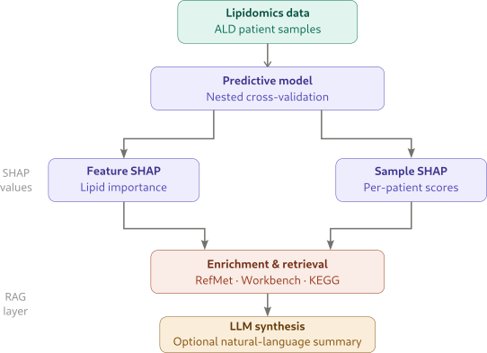

# :mag::dna: SHAP-RAG

SHAP-RAG is a retrieval-augmented framework for interpreting machine-learning models trained on lipidomics data. The central idea is that feature attribution alone is often not enough: SHAP values identify which lipids influence a model's predictions, but they do not by themselves explain how those lipids relate to known biochemical entities, prior studies, or broader biological pathways. SHAP-RAG addresses that gap by combining SHAP-based model explanations with structured retrieval from external databases and an optional language-model synthesis step.

This repository accompanies our work on lipidomic prediction and interpretation in X-linked adrenoleukodystrophy (ALD). The SHAP-RAG paper has been accepted at the 2026 International Conference on Artificial Intelligence in Medicine.

## Overview

The workflow has two components.

1. [`src/predict.py`](src/predict.py) trains a predictive model, evaluates it with nested cross-validation, and exports SHAP values at both feature and sample level.
2. [`src/app_shap.py`](src/app_shap.py) provides an interactive web interface for exploring those SHAP results and enriching them with RefMet annotations, Metabolomics Workbench studies, KEGG pathways, and a summary generated by an LLM intentended to synthesize the retrieved information in the context of lipid importance for model predictions.

<p align="center">
  
</p>

The goal is interpretability in a practical research setting: to move from "this lipid is important for the model" toward "this lipid is important, and here is the external context that may help explain why."


## Installation

Python 3.10 or newer is recommended.

```bash
python -m venv .venv
source .venv/bin/activate
pip install -r requirements.txt
```

## Data and configuration

The repository includes the lipidomics data used in our experiments, derived from the supplementary material of [Jaspers, Yorrick RJ, et al. "Lipidomic biomarkers in plasma correlate with disease severity in adrenoleukodystrophy."](https://www.nature.com/articles/s43856-024-00605-9). The training pipeline reads `data/SupplementaryData1-with-age.xlsx`, using sheet `lipidomics_data_males`. VLCFA-restricted analyses use `data/vlcfas.csv`.

The interpretation interface can use the following environment variables:

```bash
export OPENAI_API_KEY="your-openai-key"
export LLM_API_URL="https://your-openai-compatible-endpoint/v1"  # optional
export APP_PASSWORD="your-password"  # optional
```

`OPENAI_API_KEY` enables language-model summaries. `LLM_API_URL` allows use of an OpenAI-compatible endpoint. `APP_PASSWORD` protects the Streamlit interface with a simple password gate.

## Pipeline

### Model training and SHAP export

[`src/predict.py`](src/predict.py) performs nested cross-validation for adrenal-insufficiency prediction, applies imputation and optional normalization, selects lipid features, tunes hyperparameters, and writes SHAP outputs for downstream interpretation.

Example:

```bash
python src/predict.py \
  --model_type lightgbm \
  --k 100 \
  --num_trials 30 \
  --imputer knn \
  --normalize
```

Supported model backends are `rf`, `lightgbm`, `catboost`, `xgboost`, and `tabpfn`.

Main arguments:

- `--k`: number of lipid features retained before reintroducing age.
- `--num_trials`: number of Optuna trials used for hyperparameter search.
- `--imputer`: imputation strategy, either `knn` or `min5`.
- `--normalize`: apply z-score normalization after imputation.
- `--exclude_controls`: exclude samples labeled `Control`.
- `--vlcfas_only`: restrict the feature space to VLCFA lipids plus age.

Each run creates a timestamped directory under `experiments/` containing:

- `log.json`: run configuration and cross-validation metrics.
- `*_shap_summary.png`: SHAP summary plot for each fold.
- `*_shap_feature_importance.csv`: fold-level mean absolute SHAP importances.
- `instance_shap_table.csv`: per-sample SHAP values used by the interface.

### Interactive interpretation with SHAP-RAG

[`src/app_shap.py`](src/app_shap.py) consumes the `instance_shap_table.csv` output from a completed training run. The experiment directory is supplied at launch time:

```bash
streamlit run src/app_shap.py -- \
  --exp_dir experiments/v4/2025-08-31-235806-1e9e1f
```

The repository already includes this experiment directory, which can be used directly as a reproducible example.

The application supports:

- ranking lipids by mean absolute SHAP value,
- inspecting per-sample SHAP values for a selected lipid and fold,
- identifying lipids with correlated SHAP profiles,
- retrieving RefMet annotations,
- listing related studies from Metabolomics Workbench,
- retrieving associated KEGG pathways when available,
- generating a short, evidence-aware language-model summary from the retrieved context.

## Repository structure

- [`src/predict.py`](src/predict.py): model training, evaluation, feature selection, and SHAP generation.
- [`src/app_shap.py`](src/app_shap.py): interactive SHAP-RAG interpretation interface.
- [`run_experiments.py`](run_experiments.py): utility for sweeping multiple model configurations.

## Scope

This codebase is intended as a research system for model interpretation and hypothesis generation. The retrieved evidence and generated summaries are designed to support expert analysis; they should not be treated as causal or clinical conclusions in isolation.
